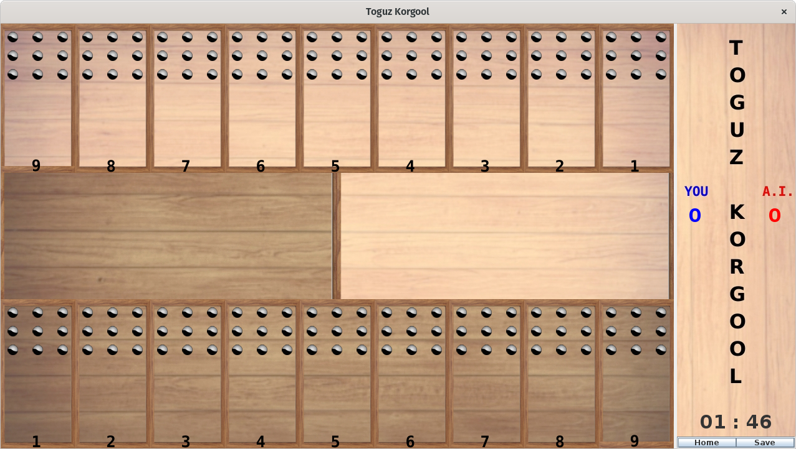
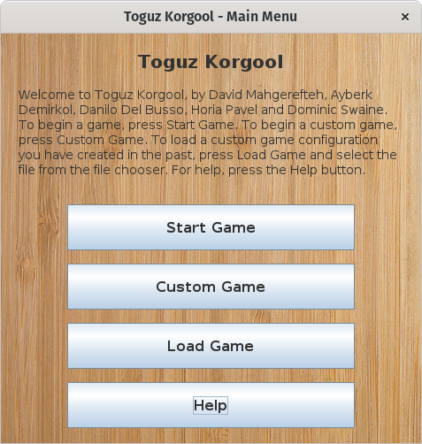

# Toguz Korgool Game

## How to run

To build the project
the following terminal command can be used:

```bash
gradle build
```

The run the project
the following terminal command can be used:

```bash
gradle run
```

## Description

The game is played on a board with two rows of nine holes.
There are two "kazan" between these rows
which are used to
collect captured stones of each user
separately.
At the beginning there are nine stones in each hole
except the kazan which are empty so players need a total of 162 stones.

## Images

### Game Board



### Main Menu



## Project structure and Gradle

- [README.md](./README.md)
- [build.gradle](./build.gradle)
- [src](./src)
  - [main](./src/main)
    - [java](./src/main/java)
      - [com/dominicswaine/seg_agile_project](./src/main/java/com/dominicswaine/seg_agile_project)
        - [main.java](./src/main/java/com/dominicswaine/seg_agile_project/main.java)
    - [resources](./src/main/resources)
  - [test](./src/test)
    - [java](./src/test/java)
    - [resources](./src/test/resources)
- [.gitignore](./.gitignore)

Empty directories contain a placeholder .gitkeep file to allow the directory structure to be uploaded to GitHub.

## Authors

- Ayberk Demirkol
- Danilo Del Busso
- David Mahgerefteh
- Dominic Swaine
- Horia Tudor Pavel Simon
